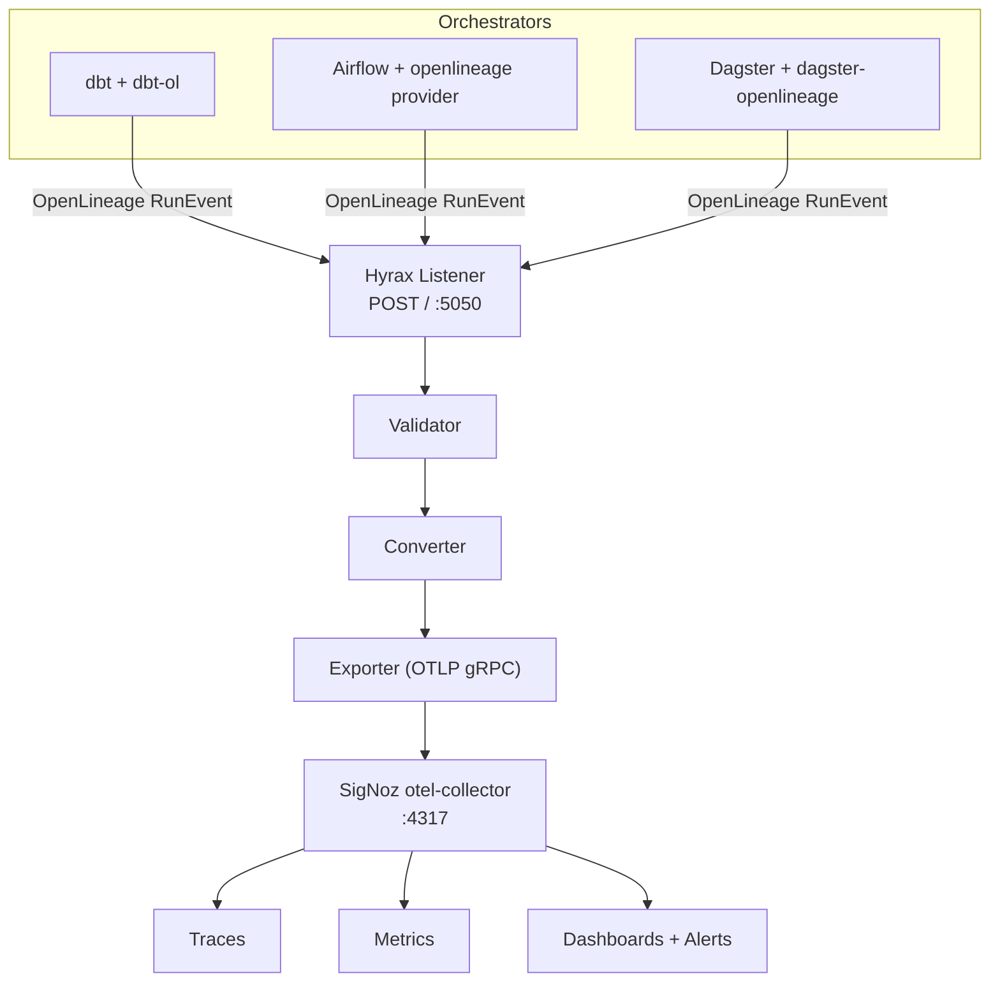

# Hyrax architecture

## Overview

Hyrax sits between orchestrators and SigNoz as a thin, stateless conversion layer. The architectural bet: build one converter against the open standard (OpenLineage) rather than one integration per orchestrator.

## Components

### 1. Listener (`hyrax/listener.py`)

- Flask HTTP server exposing `POST /`, compatible with the standard `OPENLINEAGE_URL` convention.
- Accepts `RunEvent`, `JobEvent`, and `DatasetEvent` payloads with no orchestrator-specific code.
- `/health` endpoint returns live stats (received / accepted / dropped / errors).
- Graceful shutdown flushes the OTLP batch buffer before exit.

### 2. Validator (`hyrax/validator.py`)

- Enforces OpenLineage's minimum bar: valid `runId` UUID, at least one input dataset on terminal events, at least one output dataset.
- Events missing required fields are logged and dropped — never silently converted.
- `START` events are allowed through with empty dataset arrays (dataset metadata often isn't known until completion).

### 3. Converter — the core logic (`hyrax/converter.py`)

- Maps `Run` → trace/root span, `Job` → span name, dataset edges → span attributes.
- Full field mapping is in [SCHEMA.md](./SCHEMA.md).
- `START` opens a span and stores it in an in-memory dict keyed by `runId`.
- `COMPLETE` / `FAIL` / `ABORT` closes and exports the span.
- Unknown or custom facets land under `custom.*` — nothing is dropped.
- An orchestrator emitting only the required core fields still produces a valid span; it's just thinner.

### 4. Exporter (`hyrax/exporter.py`)

- Standard OTLP gRPC exporter (`opentelemetry-exporter-otlp-proto-grpc`).
- `BatchSpanProcessor` buffers spans for efficiency.
- Endpoint is `OTEL_EXPORTER_OTLP_ENDPOINT` (default `http://localhost:4317`).
- SigNoz is the reference target — not a hard dependency. Any OTel-compatible backend works.

### 5. Metrics (`hyrax/metrics.py`)

Emits the following OTel metrics on every terminal event:

| Metric | Type | Description |
|---|---|---|
| `pipeline.runs_total` | Counter | Total runs by status/job |
| `pipeline.duration_ms` | Histogram | End-to-end run wall time |
| `pipeline.row_count` | Histogram | Output rows per run |
| `pipeline.byte_size` | Histogram | Output bytes per run |
| `pipeline.freshness_lag_s` | Histogram | Actual vs. nominal end-time delta |
| `pipeline.test_assertions` | Counter | dbt test pass/fail counts |

## Data flow example

1. `dbt-ol run` executes `stg_orders`.
2. dbt-ol emits a `START` RunEvent; Hyrax opens a span with `runId` as trace ID.
3. dbt-ol emits a `COMPLETE` RunEvent with `outputStatistics` (row count) and `schema` facet.
4. Hyrax closes the span with OK status and row count / schema attributes.
5. The OTLP batch fires to SigNoz's otel-collector.
6. SigNoz Traces shows the model run; the pre-built dashboard shows duration trend and row count.

## Deployment

Runs as a single lightweight container (`docker compose up -d`). Hyrax holds no durable state — SigNoz is the system of record. Hyrax can restart freely without data loss.

## Extensibility

Because the input is OpenLineage, adding Spark, Flink, or any other orchestrator requires **zero changes to Hyrax** — only point `OPENLINEAGE_URL` at Hyrax's listener.

## Non-goals

- Hyrax does not replace Marquez or other lineage catalogs — it is an *observability* bridge (traces, metrics, alerting), not a lineage-browsing UI.
- Hyrax does not generate OpenLineage events itself — it consumes what orchestrators already emit natively.
